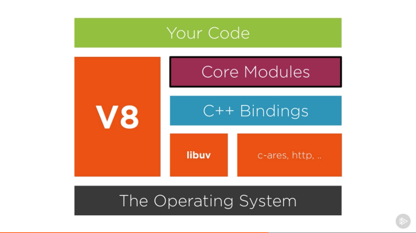
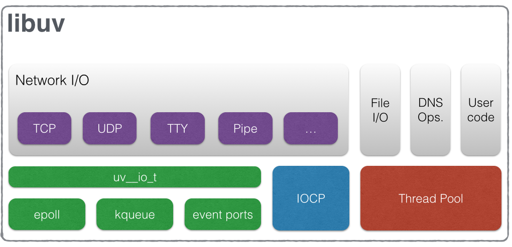

# З чого складається Node.js

`libuv` - C++ бібілотека що реалізує event loop, але крім цього має й інші фічі для взаємодії з операційною системою.  
`V8` - движок JavaScript, що використовується в Chrome, розроблений Google.  
`C/C++ bindings`  
`http-parser` (до 13 версії), `llhttp` (з 13 версії) - парсери HTTP  
`c-ares` - відповідає за DNS разом з libuv  
`OpenSSL` - crypto  
`zlib`  

## libuv
У дуже ранній версії node використовувала libev, але в 2011 році перейшла на libuv щоб додати підтримку Windows.

Libuv крім event loop має також і інші фічі:
- UDP/TCP сокети
- DNS
- File system
- Thread pool
- Child processes  
- ...

### Event loop
В ноді за event loop відповідає libuv.   
В event loop є різні фази на яких виконуються певні операції:
- timers. Тут виконуються колбеки які були засетані через `setTimeout` і `setInterval`.
- pending callbacks. Тут виконуються колбеки які були deferred на polling фазі.
Наприклад деякі TCP помилки.
- idle, prepare. Виконуються внутрішні операції.
- poll. In this phase, the event loop watches out for new async I/O callbacks.
На цій фазі node перевіряє чи є якісь нові async I/O колбеки для виконання, якщо є то колбеки то їх виконує.
Це майже всі колбки, крім setTimeout, setInterval, setImmediate and closing callbacks.
Якщо немає колбеків то залишається на цій фазі і чекає на них поки <-- це перевірити
- якщо є засетані якісь функції в setImmediate то івент луп переходить на check фазу
- якщо є заекспайрені таймери то переходить на наступну фазу
- check. Тут виконуються колбеки які були засетані через `setImmediate`.
- close callbacks. Тут виконуються колбеки типу socket.on('close', fn) чи process.exit()
Мікротаски це `process.nextTick` і `Promise` і вони виконуються на тій фазі на якій були засетані.

# Глобальні об'єкти
### Event emitter
### Stream
### Buffer
Обʼєкт для роботи з даними що мають фіксований розмір, що дозволяє працювати з бінарними даними, наприклад файлами чи TCP стрімом.
Buffer є сабкласом джаваскріптовог `Uint8Array`, який може мати елементи зі значенням лише від 0 до 255, тобто один байт.

## Багатопоточність

